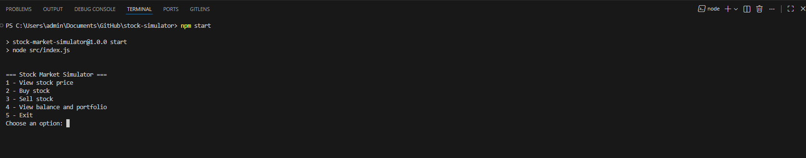
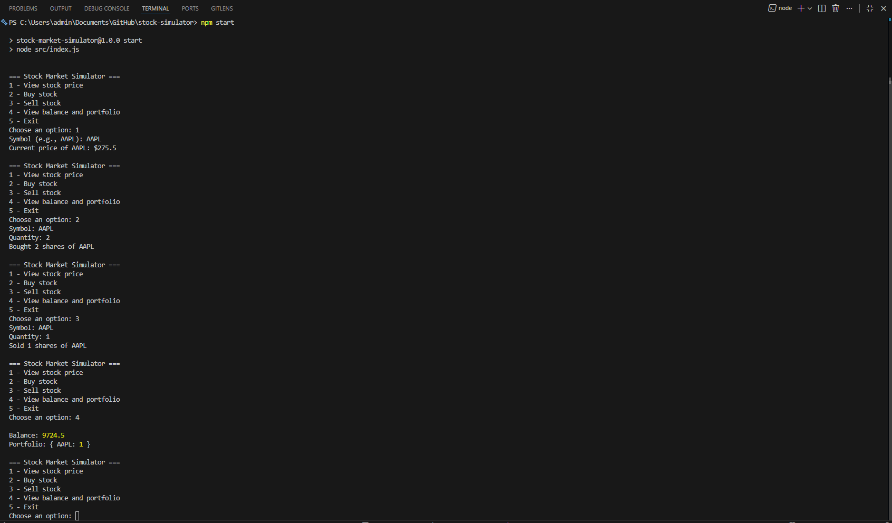
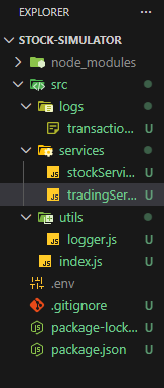

# 📈 Stock Market Simulator (Node.js)

A backend-focused Stock Market Simulator built with Node.js.

This application integrates with a public stock market API to fetch real-time stock prices and allows users to simulate buying and selling stocks directly from the terminal.

The main focus of this project is backend architecture, business logic, API integration, and transaction logging.

---

## 🚀 Features

✔️ Real-time stock price fetching from public API  
✔️ Buy and sell stock simulation  
✔️ Portfolio management  
✔️ Balance tracking  
✔️ Transaction logging system  
✔️ Clean project architecture  
✔️ Error handling (API limit, invalid symbols, insufficient balance)

---

## 🧠 Project Architecture

This project follows a modular backend structure:

src/
├── services/ # Business logic (stock + trading logic)
├── utils/ # Logger utilities
├── logs/ # Transaction logs
└── index.js # Application entry point


Clear separation of concerns was applied to simulate real-world backend project organization.

---

## 🖥 Running Application (Terminal Interface)

The system runs entirely in the terminal, reinforcing backend-focused development.




---

## 📂 Project Structure

Organized folder structure for scalability and maintainability:



---

## ⚙️ How It Works

1. User selects an option from the terminal menu.
2. The application fetches stock price via API.
3. Business logic validates:
   - Available balance
   - Portfolio shares
   - API responses
4. Transactions are recorded in:

src/logs/transactions.log


---

## 🛠 Technologies Used

- Node.js
- ES Modules
- Axios (API requests)
- File System (fs) for logging
- Public Stock API (e.g. Alpha Vantage)

---

## ▶️ How to Run

### 1️⃣ Clone the repository

```bash
git clone <your-repository-url>
cd stock-simulator
2️⃣ Install dependencies
npm install
3️⃣ Create a .env file
API_KEY=your_stock_api_key_here
4️⃣ Start the application
npm start
📊 Example Workflow
1 - View stock price
2 - Buy stock
3 - Sell stock
4 - View balance and portfolio
5 - Exit
Example:

Choose an option: 1
Symbol (e.g., AAPL): AAPL
Current price of AAPL: $275.50
📌 Logging System
Every transaction (buy/sell) is stored in:

src/logs/transactions.log
This simulates a real backend logging mechanism.

🎯 Project Objective
This project was developed to:

Practice API integration

Apply backend architecture principles

Simulate business rules

Implement transaction logging

Strengthen backend-focused development skills

The interface was intentionally kept simple to emphasize backend logic and structure.

📎 Author
Vitor Dutra Melo
Backend Developer | Node.js | REST APIs | JavaScript
